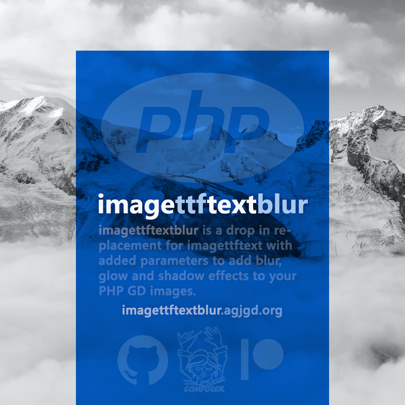

# imagettftextblur

## Description

**imagettftextblur** is a drop-in replacement for imagettftext with added parameters to add blur, glow and shadow effects to your PHP GD images.

**imagettftextblur** is an [agjgd](https://agjgd.org) project.

## Examples

    // In PHP 8.0 a ninth parameter ($options) was added to imagettftext()
    imagettftext($im, 20, 0, 0, 0, $color, $font, $string, array()); // Add text to a GD image
    imagettftextblur($im, 20, 0, 0, 0, $color, $font, $string, array()); // This works the same as the line above
    imagettftextblur($im, 20, 0, 0, 0, $color, $font, $string, array(), 1); // This will add the same text only blurred

    // We also support previous versions of PHP back to 5.0 and the previous version of imagettftext()
    imagettftext($im, 20, 0, 0, 0, $color, $font, $string); // Add text to a GD image
    imagettftextblur($im, 20, 0, 0, 0, $color, $font, $string); // This works the same as the line above
    imagettftextblur($im, 20, 0, 0, 0, $color, $font, $string, 1); // This will add the same text only blurred

There are [other examples](https://github.com/andrewgjohnson/imagettftextblur/tree/master/examples) included in the GitHub repository and on [imagettftextblur.agjgd.org](https://imagettftextblur.agjgd.org/examples/).

## Usage

### With Composer

This project offers support for the [Composer](https://getcomposer.org/) dependency manager. You can find the imagettftextblur package online on [packagist.org](https://packagist.org/packages/andrewgjohnson/imagettftextblur).

#### Install using Composer

Either run this command:

    composer require andrewgjohnson/imagettftextblur

or add this to the `require` section of your composer.json file:

    "andrewgjohnson/imagettftextblur": "1.*"

### Without Composer

To use without Composer add an [include](https://www.php.net/manual/en/function.include.php) to the [`imagettftextblur.php` source file](https://raw.githubusercontent.com/andrewgjohnson/imagettftextblur/master/source/imagettftextblur.php).

    include 'source/imagettftextblur.php';

## Help Requests

Please post any questions in the [discussions area](https://github.com/andrewgjohnson/imagettftextblur/discussions) on GitHub if you need help.

If you discover a bug please [enter an issue](https://github.com/andrewgjohnson/imagettftextblur/issues/new) on GitHub. When submitting an issue please use our [issue templates](https://github.com/andrewgjohnson/imagettftextblur/tree/master/.github/ISSUE_TEMPLATE).

## Contributing

Please read our [contributing guidelines](https://github.com/andrewgjohnson/imagettftextblur/blob/master/.github/CONTRIBUTING.md) if you want to contribute.

You can contribute financially by becoming a [patron](https://patreon.com/agjopensource) at [patreon.com/agjopensource](https://patreon.com/agjopensource) to support imagettftextblur and [other agjgd.org projects](https://agjgd.org/projects/).

## Acknowledgements

This project was started by [Andrew G. Johnson (@andrewgjohnson)](https://github.com/andrewgjohnson).

Full list of contributors:
 * [Andrew G. Johnson (@andrewgjohnson)](https://github.com/andrewgjohnson)
 * [Philip van Heemstra (@vHeemstra)](https://github.com/vHeemstra)
 * [Imgbot (@ImgBotApp)](https://github.com/ImgBotApp)

Our [security policies and procedures](https://github.com/andrewgjohnson/imagettftextblur/blob/master/.github/SECURITY.md) come via the [atomist/samples](https://github.com/atomist/samples/blob/master/SECURITY.md) project. Our [issue templates](https://github.com/andrewgjohnson/imagettftextblur/tree/master/.github/ISSUE_TEMPLATE) come via the [tensorflow/tensorflow](https://github.com/tensorflow/tensorflow/blob/master/SECURITY.md) project. Our [pull request template](https://github.com/andrewgjohnson/imagettftextblur/blob/master/.github/PULL_REQUEST_TEMPLATE.md) comes via the [stevemao/github-issue-templates](https://github.com/stevemao/github-issue-templates) project. The [Jekyll theme](https://github.com/andrewgjohnson/open-source-documentation-jekyll-theme) was released by [Andrew G. Johnson](https://github.com/andrewgjohnson).

## Changelog

You can find all notable changes in the [changelog](https://github.com/andrewgjohnson/imagettftextblur/blob/master/CHANGELOG.md).
